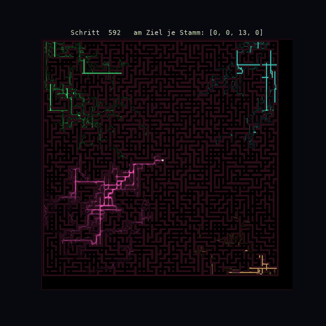
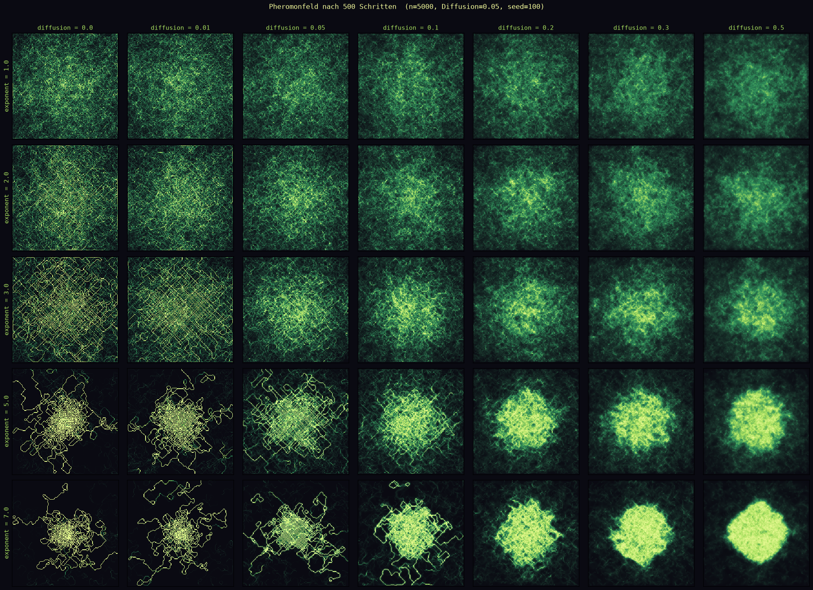
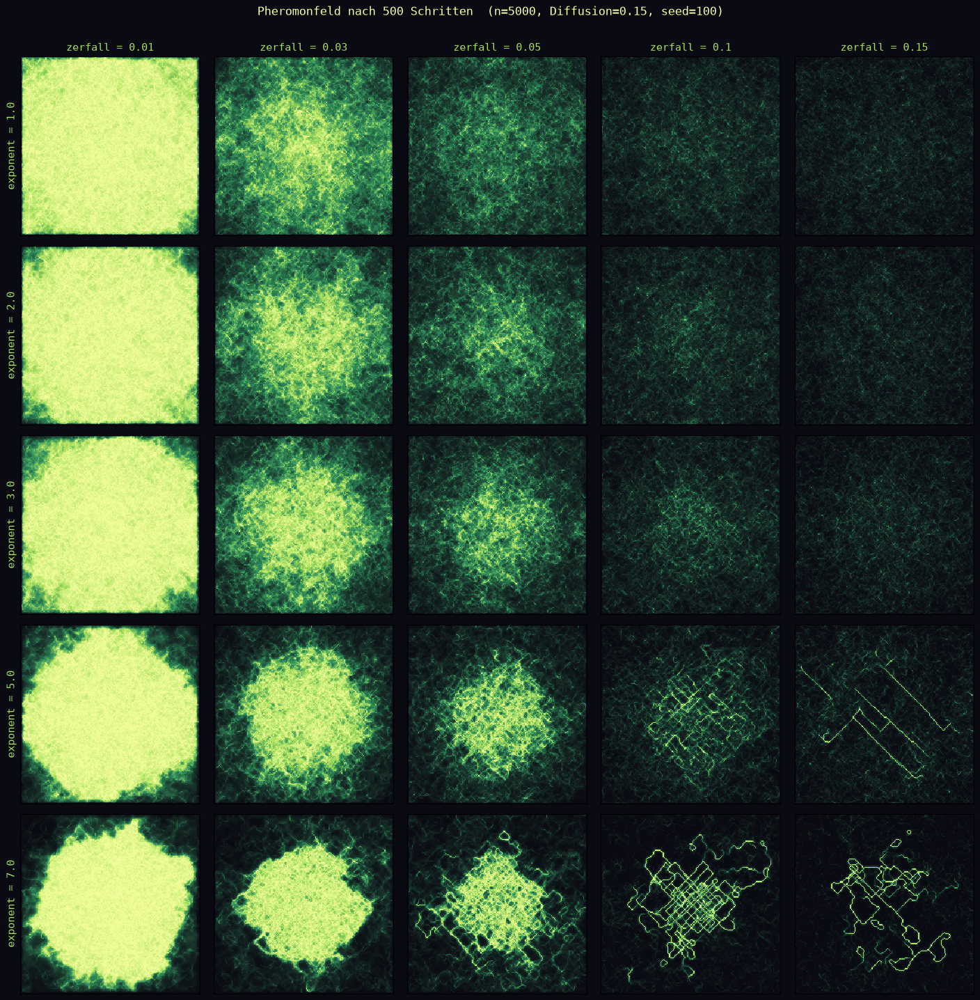

# Physarum-Labyrinth-Race-
So I had this university task to create a physarum simulation and they told us to look at it in a creative way... I ended up doin labyrinth races 

A single slime mold simulation - [Video Simulation](https://files.catbox.moe/fxqldu.gif)

Here is a picture of what a frame can look like :) 

The pheromone concentration for diffrent exponent and diffusion values

The pheromone concentrations for diffrent exponent and zerfall values (zerfall means how many percentage per step of a pheromon trace will dissolve)

